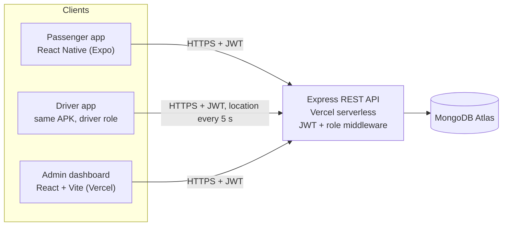

# Ceylon Smart Bus

Real-time public bus tracking and digital ticketing for Sri Lanka — IT3060 Human Computer Interaction, group **WE-133**, Milestone 03.

One Android app serves **passengers** (find routes, track buses live, buy tickets, receive alerts) and **drivers**
(run trips, verify tickets, report delays). A web **admin dashboard** manages routes, buses, drivers, delays,
announcements, finance and inquiries.

## Architecture



Live tracking uses HTTP polling (every 5 s) because WebSockets are not available on Vercel serverless functions.

## Tech stack

| Layer | Choice |
|---|---|
| Mobile | React Native + Expo, Expo Router, JavaScript |
| Maps / location / QR | react-native-maps, expo-location, react-native-qrcode-svg, expo-camera |
| Storage on device | expo-secure-store (JWT), AsyncStorage (offline ticket cache) |
| API | Node.js + Express (CommonJS), layered routes → controller → service → model |
| Database | MongoDB Atlas + Mongoose |
| Auth | JWT + bcryptjs, roles `passenger`, `driver`, `admin` |
| Admin | React + Vite, React Router, Recharts, lucide-react, plain CSS variables |
| Hosting / build | Vercel (API), Netlify (admin dashboard), local Gradle build (Android APK) |

Full justification: [docs/PROJECT_PLAN.md](docs/PROJECT_PLAN.md) §4.

## Folder structure

```
server/   Express API (one folder per module in src/modules)
admin/    React + Vite admin dashboard (one folder per page in src/pages)
mobile/   Expo app (thin route files in app/, real code in src/features)
docs/     plan, ERD, developer guide, design tokens, API contracts, tests, evidence
tooling/  shared ESLint list of banned generic identifiers
```

Detailed tree and ownership: [docs/REPO_STRUCTURE.md](docs/REPO_STRUCTURE.md). Team rules: [CLAUDE.md](CLAUDE.md) and [docs/DEVELOPER_GUIDE.md](docs/DEVELOPER_GUIDE.md).

## Prerequisites

- Node.js 20 or newer (`.nvmrc` pins 20) and npm
- A MongoDB connection string (MongoDB Atlas free tier, or a local MongoDB)
- Expo Go on an Android phone (development) — the phone and laptop must be on the same Wi-Fi
- An Expo account for EAS builds (release only)

## Setup and run

```bash
npm run install:all          # installs server, admin and mobile
```

**API** (http://localhost:5000)
```bash
cd server
cp .env.example .env         # fill MONGODB_URI and JWT_SECRET
npm run seed                 # demo data (refuses to run when NODE_ENV=production)
npm run dev
```

**Admin dashboard** (http://localhost:5173)
```bash
cd admin
cp .env.example .env         # VITE_API_URL=http://localhost:5000/api
npm run dev
```

**Mobile**
```bash
cd mobile
cp .env.example .env         # EXPO_PUBLIC_API_URL=http://<your-laptop-LAN-IP>:5000/api
npm run start                # scan the QR code with Expo Go
```

Lint everything with `npm run lint:all`.

## Environment variables (names only)

| Package | Variables |
|---|---|
| server | `MONGODB_URI`, `JWT_SECRET`, `JWT_EXPIRES_IN`, `CLIENT_ORIGINS`, `PORT`, `NODE_ENV` |
| admin | `VITE_API_URL` |
| mobile | `EXPO_PUBLIC_API_URL`, `GOOGLE_MAPS_API_KEY` |

Never commit `.env` files; only `.env.example` is tracked.

## Seed accounts (demo data only)

`npm run seed` prints these logins. All demo accounts share the demo password defined in
`server/src/seed/data/m01Accounts.js`.

| Role | Email | Mobile |
|---|---|---|
| Admin | admin@ceylonsmartbus.lk | 0770000001 |
| Driver | sunil.driver@ceylonsmartbus.lk | 0771000001 |
| Driver | ruwan.driver@ceylonsmartbus.lk | 0771000002 |
| Passenger | anjali.perera@example.com | 0772000001 |
| Passenger | kasun.wijesinghe@example.com | 0772000002 |
| Passenger | tharushi.fernando@example.com | 0772000003 |

## Deployment

| Part | Where | How |
|---|---|---|
| API | Vercel project, Root Directory `server` | **Live: https://ceylon-smart-bus.vercel.app/api** &middot; set `MONGODB_URI`, `JWT_SECRET`, `JWT_EXPIRES_IN`, `CLIENT_ORIGINS` (admin URL), `RESEND_API_KEY`, and `NODE_ENV=development` (see the Developer Guide for why the demo runs that way) |
| Admin | **Netlify site** | `netlify.toml` at the repo root carries the build settings, so only one thing needs adding in the UI: `VITE_API_URL=https://ceylon-smart-bus.vercel.app/api`. Vite bakes it in at build time, so add it **before** the first deploy or redeploy afterwards |
| Database | MongoDB Atlas M0 | Network Access `0.0.0.0/0` (Vercel IPs are dynamic) |
| CORS | On the API project | `CLIENT_ORIGINS` must list the Netlify URL exactly, no trailing slash &mdash; then **redeploy the API**, since environment changes do not reach an existing deployment |
| APK | Gradle, on a laptop with the Android SDK | `cd mobile/android && EXPO_PUBLIC_API_URL="https://ceylon-smart-bus.vercel.app/api" ./gradlew assembleRelease`. Needs **JDK 17 or 21** and a **short checkout path** such as `C:\dev\Ceylon_Smart_Bus` &mdash; see the Developer Guide, section 10. No maps key is needed: the maps are Leaflet over OpenStreetMap |

## Links

- **API:** https://ceylon-smart-bus.vercel.app/api &mdash; check it with `/api/health`
- **APK:** added at release
- **Admin URL:** added at release

## Team

| Member | Student ID | Name | Responsibility |
|---|---|---|---|
| 01 | | | Accounts (register, OTP, login, profile, driver registration) |
| 02 | | | Routes, buses, trips and live tracking |
| 03 | | | Tickets, seats, payments, verification, inquiries |
| 04 | | | Home, notifications, delay reporting, admin overview, shared design system |

## Academic note

University coursework for IT3060 (Human Computer Interaction). Not licensed for commercial use. Route data,
coordinates and fares in the seed are approximate demo values.
