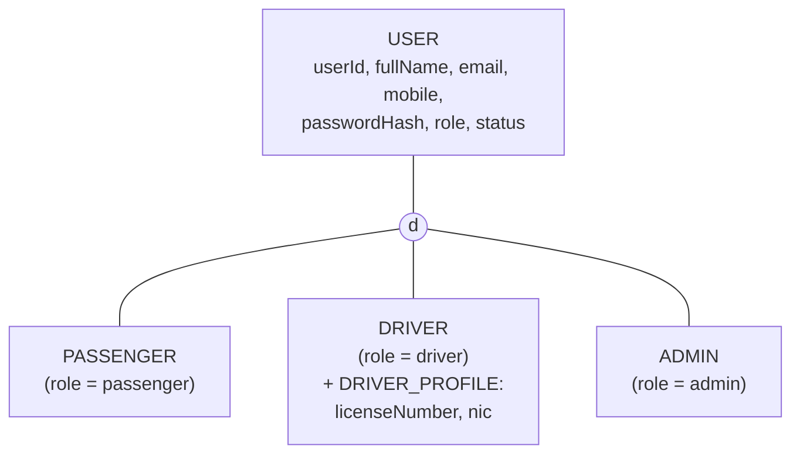
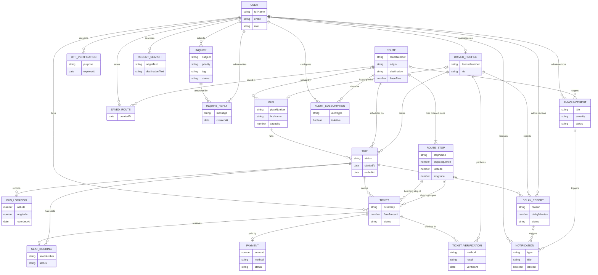

# Ceylon Smart Bus — EER & Relational Diagrams

> Render: GitHub, VS Code (Markdown Preview Mermaid Support) and https://mermaid.live all render the diagrams below.
> Export PNG/SVG from mermaid.live for the report (Section "System/app architecture overview").
>
> **Database note (for the report/viva):** the app uses MongoDB (MERN). The EER/relational model below is the
> *logical* design. In Mongoose each table is a collection, each FK is an `ObjectId` reference (`ref:`),
> and each UK is a unique index. This keeps the design relational-thinking while using the MERN stack.

---

## 1. EER Diagram — Part A: Specialisation (ISA)

`User` is a supertype with a **disjoint, total** specialisation into three roles. Only drivers need extra attributes,
so `DriverProfile` is stored separately; passengers and admins need nothing beyond `User`.



*d = disjoint (a user has exactly one role). Total participation (every user is one of the three).*

---

## 2. EER Diagram — Part B: Entities & Relationships (key attributes only)



**Cardinality notes worth knowing for the viva**

| Rule | Where it is enforced |
|---|---|
| One driver ↔ at most one bus; one bus ↔ at most one route at a time | `Bus.driverId` unique (sparse), `Bus.routeId` |
| A seat can be booked once per trip | Unique index `(tripId, seatNumber)` on active bookings |
| One passenger can hold one alert subscription per route | Unique index `(userId, routeId)` |
| A passenger may delete/edit an inquiry only within 5 minutes of creating it | `Inquiry.createdAt` checked in the service layer (Member 03) |
| A delay report must belong to an **ongoing** trip | `DelayReport.tripId` → `Trip.status = ongoing` check (Member 04) |
| Announcement `targetRouteId = null` means "all passengers" | Fan-out logic in `announcementService` (Member 04) |

---

## 3. Relational Diagram (logical schema with PK / FK / UK)

```mermaid
erDiagram
    USER {
        ObjectId userId PK
        string fullName
        string email UK
        string mobile UK
        string passwordHash
        string role "passenger | driver | admin"
        string status "active | blocked"
        string avatarUrl
        string appPinHash "null until the app lock is turned on"
        date appPinSetAt
        date createdAt
        date updatedAt
    }
    DRIVER_PROFILE {
        ObjectId driverId PK
        ObjectId userId FK "UK"
        string licenseNumber UK
        string nic UK
        date createdAt
    }
    OTP_VERIFICATION {
        ObjectId otpId PK
        ObjectId userId FK
        string codeHash
        string purpose "register | reset"
        date expiresAt
        boolean isUsed
    }
    ROUTE {
        ObjectId routeId PK
        string routeNumber UK
        string routeName
        string origin
        string destination
        number baseFare
        string status "active | inactive"
        date createdAt
    }
    ROUTE_STOP {
        ObjectId stopId PK
        ObjectId routeId FK
        string stopName
        number latitude
        number longitude
        number stopSequence "UK with routeId"
        number fareFromOrigin
    }
    BUS {
        ObjectId busId PK
        string plateNumber UK
        string busName
        number capacity
        string status "active | maintenance"
        ObjectId driverId FK "nullable, UK"
        ObjectId routeId FK "nullable"
    }
    TRIP {
        ObjectId tripId PK
        ObjectId busId FK
        ObjectId routeId FK
        ObjectId driverId FK
        string status "ongoing | completed | cancelled"
        date startedAt
        date endedAt
        number lastLatitude
        number lastLongitude
        date lastLocationAt
    }
    BUS_LOCATION {
        ObjectId locationId PK
        ObjectId tripId FK
        number latitude
        number longitude
        number speedKmh
        date recordedAt
    }
    SAVED_ROUTE {
        ObjectId savedRouteId PK
        ObjectId userId FK
        ObjectId routeId FK "UK with userId"
        date createdAt
    }
    RECENT_SEARCH {
        ObjectId searchId PK
        ObjectId userId FK
        string originText
        string destinationText
        ObjectId routeId FK "nullable"
        date searchedAt
    }
    TICKET {
        ObjectId ticketId PK
        string ticketKey UK "human-readable lookup key"
        ObjectId userId FK
        ObjectId tripId FK
        ObjectId routeId FK
        ObjectId boardingStopId FK
        ObjectId alightingStopId FK
        number fareAmount
        string status "active | used | cancelled | expired"
        string qrSignature
        date validUntil
        date createdAt
        date updatedAt
        date cancelledAt
    }
    SEAT_BOOKING {
        ObjectId seatBookingId PK
        ObjectId tripId FK "UK with seatNumber"
        ObjectId ticketId FK "UK"
        string seatNumber
        string status "booked | released"
        date bookedAt
    }
    PAYMENT {
        ObjectId paymentId PK
        ObjectId ticketId FK "UK"
        number amount
        string method "card | cash | wallet (mock)"
        string status "paid | refunded | failed"
        date paidAt
    }
    TICKET_VERIFICATION {
        ObjectId verificationId PK
        ObjectId ticketId FK
        ObjectId driverId FK
        string method "qr | ticketKey"
        string result "valid | invalid"
        date verifiedAt
    }
    INQUIRY {
        ObjectId inquiryId PK
        ObjectId userId FK "passenger or driver"
        string subject
        string message
        string priority "high | medium | low"
        string tag "ticketing_payment | route | delay | harassment | ..."
        ObjectId routeId FK "nullable"
        ObjectId busId FK "nullable"
        ObjectId driverId FK "nullable"
        string status "open | replied | closed"
        date createdAt
        date updatedAt
        date closedAt
    }
    INQUIRY_REPLY {
        ObjectId replyId PK
        ObjectId inquiryId FK
        ObjectId adminId FK
        string message
        date createdAt
    }
    NOTIFICATION {
        ObjectId notificationId PK
        ObjectId userId FK
        string type "bus_approaching | delay | ticket | payment | announcement | inquiry_reply"
        string title
        string message
        ObjectId routeId FK "nullable"
        ObjectId tripId FK "nullable"
        ObjectId delayReportId FK "nullable"
        ObjectId announcementId FK "nullable"
        boolean isRead
        date createdAt
    }
    ALERT_SUBSCRIPTION {
        ObjectId subscriptionId PK
        ObjectId userId FK
        ObjectId routeId FK "UK with userId"
        string alertType "approaching | delay | both"
        boolean isActive
        date createdAt
        date updatedAt
    }
    DELAY_REPORT {
        ObjectId delayReportId PK
        ObjectId tripId FK
        ObjectId driverId FK
        string reason "heavy_traffic | road_closure | mechanical | weather | other"
        string reasonNote
        number delayMinutes
        string status "active | resolved | cancelled"
        string adminNote
        ObjectId reviewedBy FK "nullable admin"
        date createdAt
        date updatedAt
        date resolvedAt
    }
    ANNOUNCEMENT {
        ObjectId announcementId PK
        ObjectId adminId FK
        ObjectId targetRouteId FK "nullable = all routes"
        string title
        string message
        string severity "info | warning | critical"
        string status "draft | published | archived"
        date publishedAt
        date expiresAt
        date createdAt
        date updatedAt
    }

    USER ||--o| DRIVER_PROFILE : userId
    USER ||--o{ OTP_VERIFICATION : userId
    ROUTE ||--|{ ROUTE_STOP : routeId
    ROUTE |o--o{ BUS : routeId
    DRIVER_PROFILE |o--o| BUS : driverId
    BUS ||--o{ TRIP : busId
    ROUTE ||--o{ TRIP : routeId
    DRIVER_PROFILE ||--o{ TRIP : driverId
    TRIP ||--o{ BUS_LOCATION : tripId
    USER ||--o{ SAVED_ROUTE : userId
    ROUTE ||--o{ SAVED_ROUTE : routeId
    USER ||--o{ RECENT_SEARCH : userId
    USER ||--o{ TICKET : userId
    TRIP ||--o{ TICKET : tripId
    TICKET ||--o| SEAT_BOOKING : ticketId
    TRIP ||--o{ SEAT_BOOKING : tripId
    TICKET ||--o| PAYMENT : ticketId
    TICKET ||--o{ TICKET_VERIFICATION : ticketId
    DRIVER_PROFILE ||--o{ TICKET_VERIFICATION : driverId
    USER ||--o{ INQUIRY : userId
    INQUIRY ||--o{ INQUIRY_REPLY : inquiryId
    USER ||--o{ INQUIRY_REPLY : adminId
    USER ||--o{ NOTIFICATION : userId
    DELAY_REPORT |o--o{ NOTIFICATION : delayReportId
    ANNOUNCEMENT |o--o{ NOTIFICATION : announcementId
    USER ||--o{ ALERT_SUBSCRIPTION : userId
    ROUTE ||--o{ ALERT_SUBSCRIPTION : routeId
    TRIP ||--o{ DELAY_REPORT : tripId
    DRIVER_PROFILE ||--o{ DELAY_REPORT : driverId
    USER ||--o{ ANNOUNCEMENT : adminId
```



### Relational notation (copy into the report)

```
USER(userId PK, fullName, email UK, mobile UK, passwordHash, role, status, avatarUrl, appPinHash, appPinSetAt, createdAt, updatedAt)
DRIVER_PROFILE(driverId PK, userId FK→USER UK, licenseNumber UK, nic UK, createdAt)
OTP_VERIFICATION(otpId PK, userId FK→USER, codeHash, purpose, expiresAt, isUsed)
ROUTE(routeId PK, routeNumber UK, routeName, origin, destination, baseFare, status, createdAt)
ROUTE_STOP(stopId PK, routeId FK→ROUTE, stopName, latitude, longitude, stopSequence, fareFromOrigin)  UK(routeId, stopSequence)
BUS(busId PK, plateNumber UK, busName, capacity, status, driverId FK→DRIVER_PROFILE UK null, routeId FK→ROUTE null)
TRIP(tripId PK, busId FK→BUS, routeId FK→ROUTE, driverId FK→DRIVER_PROFILE, status, startedAt, endedAt, lastLatitude, lastLongitude, lastLocationAt)
BUS_LOCATION(locationId PK, tripId FK→TRIP, latitude, longitude, speedKmh, recordedAt)
SAVED_ROUTE(savedRouteId PK, userId FK→USER, routeId FK→ROUTE, createdAt)  UK(userId, routeId)
RECENT_SEARCH(searchId PK, userId FK→USER, originText, destinationText, routeId FK→ROUTE null, searchedAt)
TICKET(ticketId PK, ticketKey UK, userId FK→USER, tripId FK→TRIP, routeId FK→ROUTE, boardingStopId FK→ROUTE_STOP, alightingStopId FK→ROUTE_STOP, fareAmount, status, qrSignature, validUntil, createdAt, updatedAt, cancelledAt)
SEAT_BOOKING(seatBookingId PK, tripId FK→TRIP, ticketId FK→TICKET UK, seatNumber, status, bookedAt)  UK(tripId, seatNumber)
PAYMENT(paymentId PK, ticketId FK→TICKET UK, amount, method, status, paidAt)
TICKET_VERIFICATION(verificationId PK, ticketId FK→TICKET, driverId FK→DRIVER_PROFILE, method, result, verifiedAt)
INQUIRY(inquiryId PK, userId FK→USER, subject, message, priority, tag, routeId FK→ROUTE null, busId FK→BUS null, driverId FK→DRIVER_PROFILE null, status, createdAt, updatedAt, closedAt)
INQUIRY_REPLY(replyId PK, inquiryId FK→INQUIRY, adminId FK→USER, message, createdAt)
NOTIFICATION(notificationId PK, userId FK→USER, type, title, message, routeId FK null, tripId FK null, delayReportId FK null, announcementId FK null, isRead, createdAt)
ALERT_SUBSCRIPTION(subscriptionId PK, userId FK→USER, routeId FK→ROUTE, alertType, isActive, createdAt, updatedAt)  UK(userId, routeId)
DELAY_REPORT(delayReportId PK, tripId FK→TRIP, driverId FK→DRIVER_PROFILE, reason, reasonNote, delayMinutes, status, adminNote, reviewedBy FK→USER null, createdAt, updatedAt, resolvedAt)
ANNOUNCEMENT(announcementId PK, adminId FK→USER, targetRouteId FK→ROUTE null, title, message, severity, status, publishedAt, expiresAt, createdAt, updatedAt)
```

---

## 4. Table ownership (who writes the Mongoose model)

| Member | Owns these tables |
|---|---|
| 01 | `USER`, `DRIVER_PROFILE`, `OTP_VERIFICATION` |
| 02 | `ROUTE`, `ROUTE_STOP`, `BUS`, `TRIP`, `BUS_LOCATION`, `SAVED_ROUTE` |
| 03 | `TICKET`, `SEAT_BOOKING`, `PAYMENT`, `TICKET_VERIFICATION`, `INQUIRY`, `INQUIRY_REPLY` |
| 04 | `NOTIFICATION`, `ALERT_SUBSCRIPTION`, `DELAY_REPORT`, `ANNOUNCEMENT`, `RECENT_SEARCH` |

> **Rule:** only the owner edits a model file. Everyone else changes a model by asking the owner or via a PR the owner approves.

## 5. Open decisions to confirm in the team call
1. `Inquiry.tag` final list (proposed: `ticketing_payment`, `route`, `delay`, `harassment`, `bus_condition`, `driver_conduct`, `app_issue`, `other`).
2. `Payment.method` — real gateway is out of scope in the time available; use a **mock payment** and document it as a deviation from the Milestone 02 payment flow.
3. Whether `RECENT_SEARCH` is capped (proposed: keep latest 10 per user).
