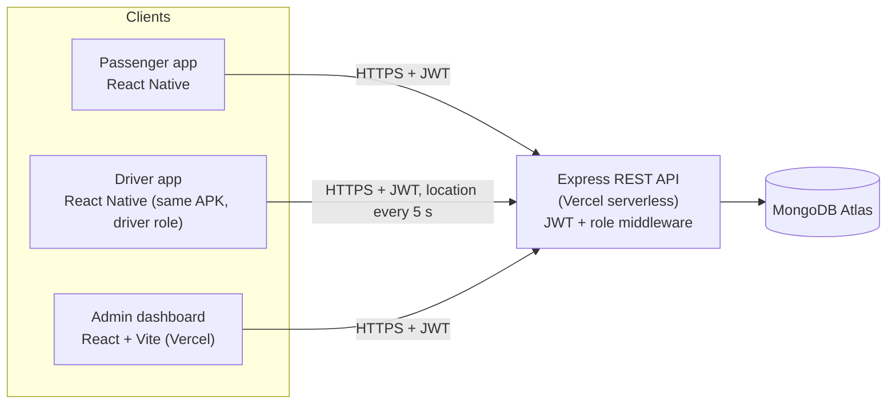

# Ceylon Smart Bus — Milestone 03 Project Plan (WE-133)

**Module:** IT3060 HCI · **Milestone:** 03 — Mobile App Implementation & Final Evaluation
**Published:** 28.09.2026 · **Deadline:** 09.10.2026 · **Weight:** 20% of final grade

---

## 0. Read this first — the schedule is the biggest risk

Today is **Sat 03.10.2026**; the deadline is **Fri 09.10.2026**. That leaves **6 working days** to deliver a working
APK, a hosted admin dashboard, ≥5-participant usability testing, functional test cases, a ≤35-page report and a viva.

Recommended rules to survive this:
1. **Feature freeze: end of Tue 06.10.** After that only bug fixes, testing and report.
2. **Build the first APK by Mon 05.10** (EAS free-tier build queues can take a long time — do not leave it to the last day).
3. **Deploy API + admin to Vercel by Tue 06.10**, so usability testers use the *real* hosted app.
4. Every member keeps **only the CRUD the brief demands** (≥2 working CRUD per interface) and polishes it, instead of adding extra features.

---

## 1. What the marking scheme rewards (20 marks)

| Component | Marks | What the examiner looks for | How we collect the evidence |
|---|---|---|---|
| Tech stack selection & justification | 3 | Each choice justified against *project requirements & constraints* | Section 4 below → report chapter |
| Implementation & fidelity | **8** | Functional completeness, **correct CRUD**, fidelity to M02 Figma + M01 requirements | Per-member CRUD table, screenshot pairs (Figma vs app), deviation log |
| Testing (functional + usability) | 5 | Test-case coverage, ≥5 real/proxy users, issues found **and addressed** | Test case sheet, traceability matrix, usability log, before/after fixes |
| Report & viva | 4 | Coherent 35-page report; each member explains *their own* code and tech decisions | Consolidated report; viva rehearsal |

> **Viva warning:** every member must individually demonstrate and explain what they built. If AI wrote a file, you must still be able
> to explain it line by line. The brief also checks the **report** for AI-written text (must be < 50%) and gives **zero marks for non-original work**.
> Use AI for code scaffolding and ideas; write the report prose yourselves.

---

## 2. Scope per member (from your message, aligned to Milestone 01/02)

| Member | Mobile (React Native) | Admin web dashboard (React) | Backend modules |
|---|---|---|---|
| **01** Accounts | Passenger register (+OTP), login, profile (view/edit) | Driver registration, user list/blocks, admin login | `auth`, `users`, `drivers` |
| **02** Route & tracking | Route search/details, saved routes, live tracking + ETA, nearest bus, driver **Start Trip** | Route create/edit (+stops), bus registration, driver↔bus assignment, bus↔route assignment, live fleet map | `routes`, `buses`, `trips`, `tracking` |
| **03** Tickets, seats & inquiries | Create/update/cancel ticket, seat choose, **My Tickets** (offline cache), driver QR/key verification, passenger+driver inquiries | Finance monitor, inquiry inbox (reply/close) | `tickets`, `seats`, `payments`, `verification`, `inquiries` |
| **04** Home, notifications, delay, admin overview | Passenger Home, Driver Home, Notifications, Driver Delay Reporting | Overview (stats first), Delay management, Announcements, Performance | `home`, `notifications`, `delays`, `announcements`, `dashboard` |

### Gaps/deviations from the Milestone 02 prototype to confirm now

These affect the "fidelity" marks because the brief says every deviation must be **documented and justified**:

| # | Item | Why it is a deviation | Suggested handling |
|---|---|---|---|
| 1 | Inquiry management (Member 03) | Not in the M02 Figma prototype | Design 3–4 simple screens in Figma using existing components, *or* document as a justified addition |
| 2 | Driver verifies tickets (QR / key) | M02 called this role "Conductor" | Keep "Driver" in app; note the role merge in the report |
| 3 | Payment | M02 had a full payment flow with success/failure states | Mock payment (no real gateway); keep success/failure screens |
| 4 | Driver registration by admin | M02 showed Driver Registration sketches in the *app* | Now done in admin dashboard; document |
| 5 | FR-11 – FR-18 wording | Only FR-01–FR-10 and NFR-01–NFR-10 wording is available in the Assignment 1 text | Copy exact wording from the master Assignment 1 file; don't paraphrase from memory |

---

## 3. Member 04 — detailed plan (your part)

### 3.1 Interfaces (from Milestone 02, selected variants kept)

| Interface | Variant | Requirement | NFR touched |
|---|---|---|---|
| Passenger Home | A — Search First | FR-07 (+ entry to FR-04) | NFR-05 (bus + ETA in ≤3 taps) |
| Driver Home | (driver dashboard from M02 testing videos) | Driver journey info | NFR-06 style (large targets) |
| Notifications | B — Notification Cards | FR-07 | NFR-03 |
| Driver Delay Reporting | C — Quick Action | FR-08 | NFR-02 (ETA accuracy) |
| Admin Dashboard (Web) | B — Statistics First | FR-14 – FR-18 (verify wording) | NFR-10 |

### 3.2 The "2 meaningful CRUD" per interface (brief §1.2 requires ≥2 working CRUD per interface)

| Interface | C | R | U | D | What makes each meaningful (not just a dummy button) |
|---|---|---|---|---|---|
| **Notifications** | Subscribe to a route's alerts (`AlertSubscription`) | List/filter/group notifications; unread count badge | Mark one/all as read; change alert type (approaching / delay / both) | Dismiss a notification; unsubscribe | Directly delivers FR-07: the passenger decides *which* routes alert them and manages the feed |
| **Driver Delay Reporting** | Submit a delay (reason + minutes) on the active trip | "My reports" history + active-delay banner | Edit minutes/reason, or **Resolve** ("back on time") | Cancel a mistaken report (soft delete → `cancelled`) | Delivers FR-08: creating/updating a delay changes the ETA passengers see **and** triggers notifications |
| **Home (passenger)** | Save a recent search automatically on search | Recent searches, nearby buses, saved-route shortcuts, recent activity | — | Remove one / clear all recent searches | Search-first Home that remembers journeys; `Home` otherwise aggregates other members' data (read-only) |
| **Admin Dashboard** | Create an announcement | Overview stats, delay table, announcement list, performance charts | Acknowledge/resolve a delay + admin note; edit/publish/archive announcement | Delete a draft/archived announcement | Admin operations loop: see delay → act → broadcast to passengers |

> Summary: Notifications 6 ops · Delay Reporting 4 · Home 3 · Admin 4+ — every interface exceeds the minimum of 2, so you stay safe even if one operation is cut.

### 3.3 Business rules (write these in the report as "implementation details")

- A driver can only report a delay while their trip is **ongoing**; one **active** delay per trip (a second submit updates the active one).
- Delay minutes allowed: 1–180. Reasons: Heavy Traffic, Road Closure, Mechanical, Weather, Other (Other requires a short note).
- **ETA propagation (FR-08):** `etaService` (Member 02) must add `getActiveDelayMinutes(tripId)` to the ETA of stops *ahead* of the bus.
- **Recipients of a delay notification:** passengers with an active `AlertSubscription` on the route, users who saved the route, and users holding an active ticket on that trip.
- Announcement with no target route = all passengers; publishing creates one `Notification` per recipient.
- Notifications are fetched by polling (every 30 s) and on app focus; the tab bar shows the unread badge.
- Driver location is exposed only as a **bus position** (NFR-08) — never show driver identity on the passenger map.

### 3.4 Your API surface

| Method & path | Role | Purpose |
|---|---|---|
| `GET /api/home/passenger?lat=&lng=` | passenger | Nearby buses, saved routes, recent activity |
| `GET /api/home/driver` | driver | Assigned bus, active trip, next stop, today's verified count, active delay |
| `POST /api/recent-searches` · `GET` · `DELETE /:id` · `DELETE /` | passenger | Recent search create/read/delete |
| `GET /api/notifications` · `GET /unread-count` | passenger | List (filter `type`, `isRead`, paging) + badge |
| `PATCH /api/notifications/:id/read` · `PATCH /read-all` | passenger | Mark read |
| `DELETE /api/notifications/:id` · `DELETE /` (clear read) | passenger | Dismiss |
| `POST/GET/PATCH/DELETE /api/alert-subscriptions` | passenger | Route alert preferences |
| `POST /api/delays` | driver | Create delay report |
| `GET /api/delays/mine` · `GET /api/delays/active` | driver | History / active banner |
| `PATCH /api/delays/:id` · `PATCH /:id/resolve` · `DELETE /:id` | driver | Update / resolve / cancel |
| `GET /api/admin/delays` · `PATCH /api/admin/delays/:id` | admin | Delay table, acknowledge/note/resolve |
| `POST/GET/PATCH/DELETE /api/admin/announcements` · `PATCH /:id/publish` | admin | Announcement CRUD + publish |
| `GET /api/admin/stats/overview` · `/performance` | admin | KPI cards + charts |

**Shared service you provide to the others (publish in the first 2 days):**
`notificationService.createNotification({ recipientUserIds, type, title, message, related })` —
Member 03 calls it for ticket/payment/inquiry-reply notifications; Member 02 for "bus approaching".

### 3.5 Design-system foundation (recommended: you own it)

Because Home, navigation and the admin shell are yours, you are best placed to build the **shared shell on Day 1**
so the other three can build screens inside it:
mobile theme tokens, `AppHeader`, `BottomTabBar`, `DrawerMenu`, `AppButton` + states, `StatusBadge`, empty/loading/error components;
admin `AdminLayout`, `Sidebar`, `TopBar`, `StatCard`, `DataTable`, `ConfirmDialog`. See `05_DEVELOPER_GUIDE.md` §5–6.
**Agree this with the team first** — it makes you a Day-1 dependency for everyone.

### 3.6 Home: finalise last (as in your Assignment 2 rule)

Build Home's search + recent searches early, but wire **shortcuts, nearby buses and recent activity only after** Member 02/03's endpoints exist (Tue 06.10).

---

## 4. Technology stack and justification (feeds the 3-mark section)

| Layer | Choice | Justification against project needs |
|---|---|---|
| Mobile | **React Native + Expo (SDK current), Expo Router, JavaScript** | One codebase for Android 8+/iOS 13+ (NFR-9); runs entry-level 2 GB devices; fast iteration; EAS builds an installable **APK** without a local Android toolchain |
| Maps & location | `react-native-maps`, `expo-location` | Live bus map (FR-02), nearest bus (FR-03/NFR-05); location used only in-session (NFR-08) |
| QR | `react-native-qrcode-svg` (ticket) · `expo-camera` barcode scanner (driver) | Scannable ticket (FR-06) and fast single-screen verification (FR-09/NFR-06) |
| Offline | `AsyncStorage` ticket cache, `expo-secure-store` for JWT | Ticket viewable offline ≥24 h (NFR-04); token stored securely (NFR-07) |
| Backend | **Node.js + Express** REST API, layered `routes → controller → service → model` | Same JS language across the team (4 members, 6 days); simple to explain in viva |
| Database | **MongoDB Atlas (free M0) + Mongoose** | Flexible schema for GPS pings & notifications, free hosted tier, indexes enforce the unique rules in the ERD |
| Auth | **JWT + bcrypt**, role middleware (passenger/driver/admin) | Hashed + salted passwords, role-based access (NFR-07) |
| Live tracking transport | **HTTP polling every 5 s** (driver posts location, passenger polls) | Meets "position ≤10 s old" (NFR-01); WebSockets do not work on Vercel serverless, so polling is the justified choice |
| Admin web | **React (Vite) + React Router**, CSS variables from design tokens; **Leaflet + OpenStreetMap tiles** for the fleet map | Same React skills as mobile. The charts are plain CSS bars, so no charting dependency was needed. Leaflet was added when the dashboard needed a real street map: it needs no API key and no account, unlike Google Maps, so the repository ships no secret (NFR-07) |
| Hosting | **Vercel Hobby** — two projects from one repo (`admin/` and `server/`), Atlas for DB | Free, matches your decision; mobile APK needs a public API URL |
| Build/Release | **EAS Build (`preview` profile → APK)**, upload to GitHub Releases | Deliverable: installable build |

**Alternative if EAS queue is too slow:** `npx expo prebuild` then `./gradlew assembleRelease` locally (needs Android SDK).
**Push notifications:** use the in-app notification centre (polling) as the deliverable; Expo push is a stretch goal because it needs FCM credentials.

### Architecture overview

---

## 5. Delivery schedule (03.10 → 09.10)

| Day | Date | Goal | Done when |
|---|---|---|---|
| 1 | Sat 03.10 | Decisions, repo, branches, Trello; **Member 04 pushes shared shell**; Member 01 pushes auth API + seed users; everyone sets up Atlas/env | `develop` runs on all 4 laptops; login works against seed data |
| 2 | Sun 04.10 | Backend models + endpoints for each member; mobile/admin screens as stubs wired to nav | Every endpoint testable in Postman/Thunder Client |
| 3 | Mon 05.10 | Mobile + admin screens complete with CRUD; **first APK build started**; merge PRs to `develop` | Each member's CRUD works end-to-end on a device |
| 4 | Tue 06.10 | Integration (Home shortcuts, delay→ETA→notification chain); deploy API + admin; **feature freeze** | Hosted admin + APK talk to hosted API |
| 5 | Wed 07.10 | Functional testing + usability sessions (≥5 users, record them); log issues | Test sheet + usability log filled |
| 6 | Thu 08.10 | Fix issues, final APK, Figma-vs-app screenshots, report assembled, viva rehearsal | Release APK on GitHub |
| 7 | Fri 09.10 | Buffer + submit | PDF named `IT3060HCI2026_Milestone03_Group<number>` uploaded |

**Report split** (35 pages max, written by humans): each member writes their own "Implementation details", "Functional tests" and "Usability results"
sections as they finish; Member 04 (or an agreed editor) merges Milestone 01/02 summaries from the submitted reports, Tech Stack, Architecture, Gantt and Conclusion.

---

## 6. Member 04 — traceability starter (requirements → prototype → implementation → tests)

| Req | Prototype screen (M02) | Implementation | Test cases (planned) |
|---|---|---|---|
| FR-07 | Notifications (Variant B), Home | `notifications` module, `AlertSubscription`, unread badge | TC-N01 list · TC-N02 mark read · TC-N03 dismiss · TC-N04 subscribe/unsubscribe · TC-N05 delay → Live Tracking deep link |
| FR-08 | Driver Delay Reporting (Variant C) | `delays` module + ETA hook | TC-D01 create · TC-D02 history · TC-D03 update · TC-D04 resolve/cancel · TC-D05 ETA increases · TC-D06 passengers notified |
| FR-04 (entry) / NFR-05 | Home (Variant A) | `home` + `recentSearches` | TC-H01 search saves recent · TC-H02 delete recent · TC-H03 nearby buses · TC-H04 bus+ETA within 3 taps |
| FR-14–FR-18 | Admin Dashboard (Variant B) | `dashboard`, `announcements`, admin delay page | TC-A01 stats load · TC-A02 delay acknowledge · TC-A03 announcement CRUD · TC-A04 publish → passenger sees notification |

*(Fill actual results only after executing the tests — never pre-write results.)*
